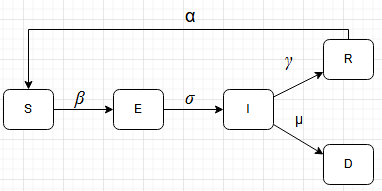

# Impactos da perda de imunidade na mortalidade. Uma análise com modelo compartimental

[](https://github.com/biguelito/CellularAutomata/blob/main/paper/Automato_de_modelo_compartimental.pdf)

## O projeto

Este projeto tem como objetivo implementar um autômato celular que represente um modelo compartimental e realizar um estudo sobre a implementação deste autômato.

### O modelo SEIRSD

Para o estudo foi utilizado o modelo SEIRSD, um modelo que possui 5 compartimentos, Suscetiveis, Expostos, Infectados, Recuperados e Mortos, que se interagem através das taxas: Taxa de infecção, beta; taxa de incubação, sigma; taxa de recuperação, gamma; taxa de mortalidade, mu e taxa de perda de imunidade, alfa.



Este modelo, assim como é um modelo compartimental, tem como objetivo simular o comportamento de uma doença em uma população. Essa simulação é feita calculando a quantidade de individuos dos compartimentos com o passar do tempo estipulado para a simulação. Cada compartimento é representado matematicamente por uma EDO, como o modelo é composto de multiplos compartimentos, isso resulta em um sistema de EDOs. Estas são as EDOs deste modelo.

$$
\frac{dS}{dt} = -\beta \cdot I \cdot \frac{S}{N} + \alpha \cdot R
$$

$$
\frac{dE}{dt} = \beta \cdot I \cdot \frac{S}{N} - \sigma \cdot E
$$

$$
\frac{dI}{dt} = \sigma \cdot E - \gamma \cdot I - \mu \cdot I
$$

$$
\frac{dR}{dt} = \gamma \cdot I - \alpha \cdot R
$$

$$
\frac{dD}{dt} = \mu \cdot I
$$

### O autômato

O autômato implementado possui 5 estados para cada célula, sendo eles identificados por números e cada número representa um compartimento do modelo compartimental. Para visualizaççao do autômato, cada estado possui uma cor. A representação do autômato segue a seguinte tabela

| número | compartimento | cor      |
|--------|---------------|----------|
| 0      | Suscetiveis   | Verde    |
| 1      | Expostos      | Amarelo  |
| 2      | Infectados    | Vermelho |
| 3      | Recuperados   | Branco   |
| 4      | Mortos        | Preto    |

<iframe src="figures/1784601145.5803924.html" width="100%" height="500px"></iframe>

### O estudo

O estudo realizado busca entender quais adaptações são necessárias para converter um modelo compartimental em um autômato celular e como essas adaptações impactam nos resultados alcançados pela nova modelagem. Para realizar o estudo foram executados o modelo compartimental e o autômato celular com as mesmas taxas e quantidade de individuos nos compartimentos/estados no inicio da execução para garantir que as 2 modelagens partiriam do mesmo ponto. Após obitido o resultado do modelo compartimental e os resultados de 10 execuções do autômato esses resultados foram comparados. O resultado está no paper deste repositório.  


## Instalação e utilização

### Localmente
```
Caso o comando "python3" não funcione, experimente somente "python"
```

1. **Configuração do ambiente**: Para garantir que o python que irá rodar o projeto possui todas as dependencias necessarias, é possivel criar um ambiente virtual e instalar nele as libs necessárias. Essas estão listadas no `requirements.txt`.

    Criando o ambiente
    ```bash
    python3 -m venv venv
    ```
    Ativando o ambiente:
    - No Windows:
    ``` 
    venv\Scripts\activate
    ```
    - No macOS/Linux:
    ``` 
    source venv/bin/activate
    ```

2. **Instalação de libs**: Com o ambiente criado, basta instalar as libs do `requirements.txt`.
    ```bash
    pip3 install -r requirements.txt
    ```

3. **Execução**: Para executar localmente, basta rodar o comando
    ```bash
    python3 simulation.py
    ```

4. **Resultado**: Os resultados serão salvos na pasta `figures`
---

**Licença:** Este projeto é distribuído sob a Licença MIT.